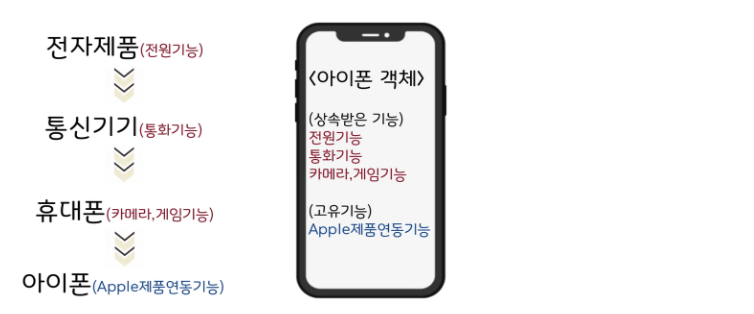

# 01_Java_basic

## 자바의 특징

- 객체지향 언어의 주요 특징
    - 캡슐화, 상속, 추상화, **다형성(중요)**
- 자동메모리 관리(가비지컬렉터)
    - 간단한 예시로 객체 생성 시 변수와 연결이 끊어진 객체를 GC가 없애줘서 메모리 관리에 용
- 멀티 쓰레드 지원
- 단순 언어뿐 아니라 JRE, JDK, library 등 다양한 환경 제공.
- 운영체제의 독립적 ← JVM 덕분임.


## 변수의 종류와 생성시기

- 클래스 변수(static변수) → 클래스가 메모리에 로딩 되었을 때
- 인스턴스 변수(멤버변수) → 객체가 생성 될 때
- 로컬변수(지역변수) → 변수 선어문이 수행되었을 떄

[변수와 메소드 생성 시기.](https://www.notion.so/a0261fe15ed7409aac0f80cf034cf9c9?pvs=21)

### 변수의 값 초기화

- 멤버 변수: 자동 초기화
    - 인스턴스의 멤버 변수는 인스턴스를 생성할 때 자동으로 초기화된다.
    - 숫자( int )= 0 , boolean = false , 참조형 = null ( null 값은 참조할 대상이 없다는 뜻으로 사용
    된다.)
    - 개발자가 초기값을 직접 지정할 수 있다.
- 지역 변수: 수동 초기화
    - 지역 변수는 항상 직접 초기화해야 한다.


## 객체와 메서드란?

- 객체 : 속성과 기능이 있는  만들어진 무언가
- 메서드  : 재사용성을 고려해 작성된 코드 집합
    - 함수와 같지만 개념적으로 메서드는 클래스 안에 있으면 메서드, 클래스 밖에서도 독립적으로 수행이 된다면 함수. ****
- **가능한 메소드는 하나의 기능만 작동하게 만드는 것이 좋다.**
    - 예로 들어 배열을 초기화 하는 코드, 출력하는 코드가 있다면 분리하여 작성하는 것이 좋다.
    ( 극단적 예시인듯? )


## Static 메소드는 언제 붙이나?

### 변수

1. 속성 중에서 공통 속성에 static 을 붙인다.
    - 즉 TV 객체를 생성하는데, 폭과 높이를 동일하게 하고 싶다면 static 변수를 사용하며, 추가로 고정까지 하고 싶다면 final 을 사용하면 된다.

### 메소드

1. 인스턴스 변수가 사용되지 않는 메소드라면 static 을 붙여주면 좋다 { 예 : Math.~~() 같은 함수 }
    - static 메서드는 인스턴스 변수와 메소드를 사용할 수 없는 이유는?
    
    static 메서드가 클래스 수준에서 공통적으로 사용되도록 설계된 메서드이기 때문이며,  static 메서드가 인스턴스 변수를 사용하게 되면, 객체마다 다른 인스턴스 변수 값으로 인해 메서드의 결과가 달라질 수 있다. 이는 static 메서드가 일관된 기능을 제공해야 한다는 원칙에 어긋나기 때문이다.


## 참조 자료형, 기본 자료형.

`int` 타입의 배열은 참조 자료형이지만, `int` 자체는 기본 자료형(primitive type)입니다. 이 두 개념을 명확히 구분하는 것이 중요합니다.

### 기본 자료형 (Primitive Types)

Java에는 8개의 기본 자료형이 있습니다:

- `byte`
- `short`
- `int`
- `long`
- `float`
- `double`
- `char`
- `boolean`

이 기본 자료형들은 실제 값(value)을 직접 저장합니다. 예를 들어, `int` 변수는 스택 메모리에 직접 정수 값을 저장합니다.

### 참조 자료형 (Reference Types)

참조 자료형은 객체의 주소값(참조)을 저장하는 변수입니다. 참조 자료형에는 다음이 포함됩니다:

- 배열
- 클래스
- 인터페이스
- 열거형 (enum)

참조 자료형 변수는 스택 메모리에 객체의 주소값을 저장하고, 실제 객체는 힙 메모리에 저장됩니다.

### 배열은 참조 자료형이다

배열은 참조 자료형입니다. 비록 배열의 요소들이 기본 자료형일 수 있지만, 배열 자체는 객체로 간주되며, 힙 영역에 할당됩니다. 배열 변수를 통해 배열 객체의 참조(주소값)를 사용하게 됩니다.

### 예제

```java
public class Main {
    public static void main(String[] args) {
        // int 타입 변수
        int number = 10; // 'number'는 기본 자료형 변수로, 스택에 직접 값을 저장합니다.

        // int 타입의 배열
        int[] numbers = new int[3]; // 'numbers'는 참조 자료형 변수로, 힙에 할당된 배열 객체를 참조합니다.

        // 배열 요소에 값 할당
        numbers[0] = 1;
        numbers[1] = 2;
        numbers[2] = 3;

        // 배열 변수와 배열 요소 출력
        System.out.println("number: " + number); // 기본 자료형 변수 출력
        System.out.println("numbers[0]: " + numbers[0]); // 참조 자료형 변수의 배열 요소 출력
    }
}

```

위 코드에서:

- `int number`는 기본 자료형 변수로, 스택 메모리에 값 10을 직접 저장합니다.
- `int[] numbers`는 참조 자료형 변수로, 힙 메모리에 할당된 배열 객체의 주소값을 저장합니다. 배열 객체는 힙 메모리에 저장되며, 배열의 각 요소(값 1, 2, 3)도 힙 메모리에 저장됩니다.

### 요약

- **기본 자료형 (Primitive Type)**: `int`, `char`, `boolean` 등, 실제 값을 스택 메모리에 직접 저장합니다.
- **참조 자료형 (Reference Type)**: 배열, 클래스, 인터페이스 등, 객체의 주소값을 스택 메모리에 저장하고, 실제 객체는 힙 메모리에 저장됩니다.
- **배열**: 참조 자료형입니다. 배열 변수는 배열 객체의 주소값을 저장하며, 배열 객체와 그 요소들은 힙 메모리에 저장됩니다.

따라서, `int` 타입은 기본 자료형이지만, `int[]` 타입의 배열은 참조 자료형입니다.

<aside>
💡 **쉽게 이해하는 TIP.**

기본형을 제외한 나머지는 모두 참조형이다.
    - 기본형은 모두 소문자로 시작한다.
    - 기본형은 자바가 기본으로 지공하는 데이터 타입이다.

클래스는 모두 대문자로 시작한다.
    - 클래스는 모두 참조형이다.

</aside>

### 참고 - String

자바에서 `String`은 특별하다. `String`은 사실 클래스다. 따라서 참조형이다. 그런데 기본형처럼 문자 값을 바로 대입할 수 있다. 그리고 `System out println` 같은 기능을 사용하여 출력할 때도 주소값이 아닌 문자값이 그대로 출력된다.

문자는 매우 자주 다루기 때문에 자바에서 특별하게 편의 기능을 제공한다.`String` 에 대한 자세한 내용은 다른 챕터에서 다루겠다.


## 오버로딩

- 정확하게는 메서드 오버로딩(Method Overloading)이라고 불리며, 오버로딩은 같은 이름의 메서드를 중복 정의하되, 각 메서드가 서로 다른 매개변수를 가지도록 하는 것

public class MathUtils {

```java
public class MathUtils {

	// 두 정수를 더하는 메서드
	public int add(int a, int b) {
	    return a + b;
	}
	
	// 세 정수를 더하는 메서드
	public int add(int a, int b, int c) {
	    return a + b + c;
	}
	
	// 두 실수를 더하는 메서드
	public double add(double a, double b) {
	    return a + b;
	}
	
	// 두 정수를 더하고 결과를 출력하는 메서드
	public void add(int a, int b, boolean print) {
	    int result = a + b;
	    if (print) {
	        System.out.println("Result: " + result);
	    }
	}
	
	public static void main(String[] args) {
	    MathUtils utils = new MathUtils();
	
	    System.out.println(utils.add(2, 3));           // 출력: 5
	    System.out.println(utils.add(2, 3, 4));        // 출력: 9
	    System.out.println(utils.add(2.5, 3.5));       // 출력: 6.0
	    utils.add(2, 3, true);                        // 출력: Result: 5
	}
	
}
```

### 왜 중복정의하냐?

- 동일한 기능을 수행하되, 입력되는 데이터의 형태나 개수에 따라 다른 방식으로 처리할 필요가 있을 때 유용합니다.

### 오버로딩 성립하기 위한 조건

- **매개변수 목록이 달라야 합니다 :** 오버로딩된 메서드는 동일한 이름을 가지지만, 매개변수의 타입, 개수, 순서가 달라야 합니다.
    - 단 같은 타입인데 순서만 다른경우는 불가능함.
- **반환 타입은 무관 :** 오버로딩은 메서드의 반환 타입과는 관계가 없습니다. 오직 매개변수 목록만이 다르면 오버로딩이 가능합니다.
- **접근 제한자는 무관 :** 오버로딩된 메서드의 접근 제한자가 다를 수 있습니다.
- **예외 목록은 무관 :** 오버로딩된 메서드가 던지는 예외가 다를 수 있습니다.


## 생성자와 this

- 생성자는 객체 생성 직후 객체를 초기화 하기 위한 특별한 메서드로 생각할 수 있다.
- 생성자는 객체를 생성할 때 호출하는 메서드로 해당 객체의 멤버 변수값을 초기화 해줄 수 있다.
    
    ```java
    public class Person {
    	    private String name;
    	    private int age;
    	
    	    // 기본 생성자
    	    public Person() {
    	        // 매개변수가 있는 생성자를 호출하여 기본 값으로 초기화
    	        this("Unknown", 0);
    	    }
    	
    	    // 이름만 초기화하는 생성자
    	    public Person(String name) {
    	        // 매개변수가 있는 생성자를 호출하여 기본 나이로 초기화
    	        this(name, 0);
    	    }
    	
    	    // 이름과 나이를 초기화하는 생성자
    	    public Person(String name, int age) {
    	        this.name = name;
    	        this.age = age;
    	    }
    	    
        }
    ```
    

### 생성자의 특징

- 생성자가 하나도 존재 하지 않을 경우 컴파일러가 기본 생성자를 만들어줌.
    - 반대로 하나라도 있으면 만들지 않기 때문에 필요에 따라 직접 만들어줘야 함.
    - 이것을 이용해서 직접 기본 생성자를 막아 객체 생성할 때 값 초기화를 강제 할 수 있음.
- 생성자 오버라이딩과 this를 통해 위와 같이 작성할 수 있다.
- 이렇게 생성자를 다양하게 만들어서 객체 생성 시 특정 값을 강제 할 수 있으며 생성자의 접근제어자를 통해서도 다양한 패턴이 가능하다.


## 상속(inheritance)

- 상속은 부모의 변수와 메서드를 물려 받아서 사용할 수 있는 것.
- 부모 객체를 감싼 더 큰 자식 객체를 만드는것 (확장_extend)

### 상속과 생성자의 응용

- 부모 클래스의 기본 생성자가 막혀 있으면(즉, 기본 생성자가 정의되지 않거나 private로 선언된 경우) 자식 클래스에서 객체를 생성할 때 컴파일 오류가 발생 시킬 수 있다. 반대로 말하면 부모 생성자의 필드 변수 값도 강제 할 수 있다.


## super, this, super(), this()

- super 와 this 는 사실 참조 변수이며 super 는 부모멤버변수, this 는 자신의 멤버변수를 나타낸다
    - 하지만 this 에 멤버 변수가 없다면 super 와 this 는 같은 멤버 변수를 나타냄

### super(), this() 는 메서드이다.

- 참조 변수와 메서드의 차이인 것이다. 더 정확하게 말하면 this 는 나의 변수, this() 는 나의 생성자 메서드 이며 super 도 동일하다.

```java
class Person {
	    private String name;
	    private int age;
	
	    // 기본 생성자
	    public Person() {
	        this("Unknown", 0); // this를 사용하여 다른 생성자를 호출
	    }
	
	    // 이름만 초기화하는 생성자
	    public Person(String name) {
	        this(name, 0); // this를 사용하여 다른 생성자를 호출
	    }
	
	    // 이름과 나이를 초기화하는 생성자
	    public Person(String name, int age) {
	        this.name = name;
	        this.age = age;
	    }
    }
```

<aside>
💡 TIP  요렇게 사이 가능하다

</aside>


## 제어자

- 제어자는 말 그대로 특정 무언가를 제어하기 위한 문법이며, 같은 제어자를 중복사용은 못한다.

### 종류

- 일반 제어자 : static, fianl, abstract, native, transient, synchronized, volatile, strictfp
- 접근 제어자 : pubilc, protected, (default), private

### fianl 제어자

| 클래스 | 변경될 수 없는 클래스, 확장될 수 없는 클래스가 된다. 즉 조상이 될 수 없다. |
| --- | --- |
| 메서드 | 변경될 수 없는 메서드, 즉 오버라이딩을 통해 재정의 할 수 없다.  *단, 오버로딩은 가능함 |
| 멤버변수     지역변수  | 변수 앞에 fianl 이 붙으면 값을 변경할 수 없는 상수가 된다. |

### 접근 제어자(access modifier)

- private  : 같은 클래스 내에서만 접근 가능
- (default) : 같은 패지키 내에서만 접근 가능하며, 아무것도 안붙인 메서드나 변수는 자동적으로 default 가 붙는다.
- protected : 같은 패지키 내에서만 접근 가능하나, 다른 패키지의 자손 클래스에서도 접근이 가능하다.
- public : 접근 제한이 없다.

### 캡슐화와 접근 제어자

- 캡슐화란? → 객체의 **상태와 행동을 하나로 묶고, 내부상태를 외부로부터 숨기면서 외부에 필요한 기능만 제공하는 개념.**
    - 주요 특징
    1. 데이터의 은닉 private 변수 사용
    2. getter, setter 메서드를 이용한 데이터 접근.
- 접근제어자를 사용하는 이유 → 외부로부터 데이터를 보호하기 위해.

> 캡슐화(Encapsulation)의 정의는 속성과 기능을 하나로 묶어서 필요한 기능을 메서드를 통해 외부에 제공하는 것 뿐만 아니라, 객체의 내부 상태를 외부로부터 숨기는 것까지 포함해야 합니다.
> 

### 그럼 왜 캡슐화를 통해 보호하냐?

1. 데이터의 무결성 → 메서드를 통해서만 데이터에 접근이 가능하기 때문에 해당 메서드의 로직을 통해 데이터의 불법적 상태를 방지할 수 있으며, 해당 데이터는 외부에서 데이터 변경이 불가능하기 때문에 일관성을 유지할 수 있다.
2. 그 외에도 불필요한 상호작용을 제한 → 응집도증가, 정보 은닉, 보안 강화가 가능하다고 하는데 아직 와닿지 않는다. → 단순 다른 예시로는 그냥 사용편의성을 늘려준다! 쓸 때 없는 기능 다 오픈해두면 사용 편의성과 만족도가 떨어지며 버그로 이어질 가능성이 높음.
(즉 의도한대로 해당 기능이 동작하지 않을 수 있음)
- 그 외 큰 이유! → 예로들어 public 인 경우 해당 메서드를 수정하면 이것이 어디에도 쓰일 수 있기 때문에 전부 확인해야 하지만 private 이면 해당 클래스 내에서만 사용중이라는 의미로 수정 시 범위가 줄어들어 생산성이 올라감.

## 캡슐화 및 제어 추상화 정리

### 캡슐화 (Encapsulation)

캡슐화는 객체 지향 프로그래밍의 기본 원칙 중 하나로, 객체의 상태(속성)와 행동(메서드)을 하나로 묶고, 외부에 필요한 인터페이스만 제공하여 객체의 내부 구현 세부 사항을 숨기는 개념입니다. 이를 통해 데이터의 무결성과 보안을 유지하고, 코드의 복잡성을 줄이며, 유지보수성을 높일 수 있습니다.

### 제어 추상화 (Control Abstraction)

제어 추상화는 복잡한 제어 구조나 프로세스를 간단한 인터페이스로 감추는 것을 말합니다. 이를 통해 복잡한 제어 흐름을 숨기고, 단순한 명령을 통해 사용자가 쉽게 기능을 사용할 수 있게 합니다.

### 데이터 추상화 (Data Abstraction)




### 관계

캡슐화는 데이터와 메서드를 하나의 단위로 묶어서 외부에서 직접 접근하지 못하게 하고, 필요한 인터페이스만 제공하는 것을 의미합니다. 이 과정에서 제어 추상화는 캡슐화의 중요한 측면 중 하나로 작용합니다. 제어 추상화를 통해 내부의 복잡한 제어 로직을 간단한 메서드로 감추고, 외부에서는 이 메서드를 통해 필요한 기능을 사용할 수 있게 합니다.

### 결론

캡슐화는 객체의 상태와 행동을 하나로 묶고, 내부 구현을 숨기면서 외부에 필요한 기능만 제공하는 개념입니다. 제어 추상화는 이러한 캡슐화의 중요한 측면 중 하나로, 복잡한 제어 로직을 단순화된 인터페이스로 감추어 외부에 제공하는 것을 의미합니다. 두 개념은 밀접하게 관련되어 있으며, 함께 사용되어 객체 지향 프로그래밍의 중요한 원칙을 실현합니다.


## 다형성

- 여러 가지 형태를 가질 수 있는 능력
    
    
    

<aside>
💡 위 그림 하나면 상속과 포함관계의 차이점, 다형성의 형변환 규칙 개념을 알 수 있다.

</aside>

### instanceof 연산자.

- 형변환 하기 전에 꼭 확인해야함

### 매개변수의 다형성

장점

- 다형적 매개변수
- 하나의 배열로 여러종류 객체 다루


## `중요` : 자바에서의 대입은 항상 변수에 들어 있는 값을 복사해서 전달한다.

```java
// 해당 코드는 해당 학생 인스턴스를 복사하는 것이 아니다.
Student student = new Student();
Student student1 = student
```

위 코드는 2개의 인스턴스가 생성 되는 것이 아니라, 변수에 들어있는 학생 객체의 메모리주소 값(예: x001)만 복사하는 것이다. 즉 student1 과 student 변수 둘다 동일한 객체를 가르키게 된다. 

### 그러면 배열에서는 어떻게 접근하게 될까?

- 참고로 배열도 참조 자료형이다.
- 단, int 배열 제외.


### 그러면 기본 자료형은 어떻게 처리되나?

예로 들어 `int a = 10;`  이라고 했을때 `int b = a;` 라는 코드를 작성하면 `int a, b` 변수에 각각 10이 복사된다. 이렇게 변수에 들어있는 값이 복사되는건 동일하다.

기존에 참조자료형은 주소값만 복사되어 실제로 객체가 복사되는 것이 아니지만, 기본자료형은 결국 10이라는 값이 2개 생기기 때문에 차이가 있다.


## Null

택배를 보낼 때 제품은 준비가 되었지만, 보낼 주소지가 아직 결정되지 않아서, 주소지가 결정될 때 까지는 주소지를 비워두어야 할 수 있다.

참조형 변수에는 항상 객체가 있는 위치를 가리키는 참조값이 들어간다.

그런데 아직 가리키는 대상이 없거나, 가리키는 대상을 나중에 입력하고 싶다면 어떻게 해야할까?
참조형 변수에서 아직 가리키는 대상이 없다면 null 이라는 특별한 값을 넣어둘 수 있다. null 은 값이 존재하지 않는, 없다는 뜻이다.

코드를 통해서 null 값에 대해 알아보자.

### null 값 할당

```java
package ref;

public class Data {
	 int value;
}
```

앞서 만들었던 Data 클래스이다. 기존 코드를 그대로 유지하면 된다.

```java
package ref;

public class NullMain1 {
	 public static void main(String[] args) {
	 Data data = null;
	 System.out.println("1. data = " + data);
	 data = new Data();
	 System.out.println("2. data = " + data);
	 data = null;
	 System.out.println("3. data = " + data);
	 }
}
```

**실행 결과** 

```java
1. data = null
2. data = ref.Data@x001
3. data = null
```


### GC(가비지컬렉터) - 아무도 참조하지 않는 인스턴스의 최후


data 에 null 을 할당했다. 따라서 앞서 생성한 x001 Data 인스턴스를 더는 아무도 참조하지 않는다. 이렇게 아무도 참조하지 않게 되면 x001 이라는 참조값을 다시 구할 방법이 없다. 따라서 해당 인스턴스에 다시 접근할 방법이 없다.

이렇게 아무도 참조하지 않는 인스턴스는 사용되지 않고 메모리 용량만 차지할 뿐이다.

C와 같은 과거 프로그래밍 언어는 개발자가 직접 명령어를 사용해서 인스턴스를 메모리에서 제거해야 했다. 만약 실수로 인스턴스 삭제를 누락하면 메모리에 사용하지 않는 객체가 가득해져서 메모리 부족 오류가 발생하게 된다.

자바는 이런 과정을 자동으로 처리해준다. 아무도 참조하지 않는 인스턴스가 있으면 JVM의 GC(가비지 컬렉션)가 더이상 사용하지 않는 인스턴스라 판단하고 해당 인스턴스를 자동으로 메모리에서 제거해준다.

객체는 해당 객체를 참조하는 곳이 있으면, JVM이 종료할 때 까지 계속 생존한다. 그런데 중간에 해당 객체를 참조하는곳이 모두 사라지면 그때 JVM은 필요 없는 객체로 판단다고 GC(가비지 컬렉션)를 사용해서 제거한다.

### NullPointerException

택배를 보낼 때 주소지 없이 택배를 발송하면 어떤 문제가 발생할까? 만약 참조값 없이 객체를 찾아가면 어떤 문제가 발생할까?

이 경우 NullPointerException 이라는 예외가 발생하는데, 개발자를 가장 많이 괴롭히는 예외이다.
NullPointerException 은 이름 그대로 null 을 가리키다(Pointer)인데, 이때 발생하는 예외(Exception)다.
null 은 없다는 뜻이므로 결국 주소가 없는 곳을 찾아갈 때 발생하는 예외이다.

객체를 참조할 때는 . (dot)을 사용한다. 이렇게 하면 참조값을 사용해서 해당 객체를 찾아갈 수 있다.그런데 참조값이 null 이라면 값이 없다는 뜻이므로, 찾아갈 수 있는 객체(인스턴스)가 없다. NullPointerException 은 이처럼 null 에 . (dot)을 찍었을 때 발생한다.

**멤버 변수와 Null**

지역 변수의 경우에는 null 문제를 파악하는 것이 어렵지 않다. 다음과 같이 멤버 변수가 null 인
경우에는 주의가 필요하다.

- 클래스 Data

```java
public class Data {
	 int value;
}
```

- 클래스 빅데이타

```java
public class BigData {
	 Data data;
	 int count;
}
```

- 메인클래스

```java
public class NullMain3 {
 public static void main(String[] args) {
	 BigData bigData = new BigData();
	 System.out.println("bigData.count=" + bigData.count);
	 System.out.println("bigData.data=" + bigData.data);
	 //NullPointerException
	 System.out.println("bigData.data.value=" + bigData.data.value);
	 
}
```

**실행결과**

```java
bigData.count=0
bigData.data=null
Exception in thread "main" java.lang.NullPointerException: Cannot read field
"value" because "bigData.data" is null
at ref.NullMain3.main(NullMain3.java:10)
```


**문제해결**

```java
public class NullMain4 {
	 public static void main(String[] args) {
	 BigData bigData = new BigData();
	 bigData.data = new Data();
	 System.out.println("bigData.count=" + bigData.count);
	 System.out.println("bigData.data=" + bigData.data);
	 System.out.println("bigData.data.value=" + bigData.data.value);
	 }
}
```

**실행결과**

```java
bigData.count=0
bigData.data=ref.Data@x002
bigData.data.value=0
```


### 정리

NullPointerException 이 발생하면 null 값에 . (dot)을 찍었다고 생각하면 문제를 쉽게 찾을 수 있다.
