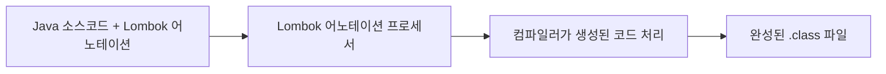

# Lombok 완벽 가이드 🦄

## 1. Lombok이란? 🧩

Lombok은 Java의 반복적인 코드(보일러플레이트 코드)를 줄여주는 라이브러리입니다. 어노테이션을 기반으로 코드 생성을 자동화하여 개발자가 비즈니스 로직에 더 집중할 수 있게 도와줍니다.

### 1.1 주요 특징 ✨

- **코드 간소화**: getter, setter, constructor 등을 자동 생성
- **가독성 향상**: 핵심 비즈니스 로직을 더 명확하게 볼 수 있음
- **오류 감소**: 수동으로 작성하는 반복적인 코드의 실수 방지
- **유지보수 용이성**: 클래스의 필드 추가/변경 시 자동 반영

### 1.2 작동 원리 🔄

Lombok은 Java 컴파일 과정에 개입하는 **어노테이션 프로세서**로 동작합니다:

1. 소스 코드에 Lombok 어노테이션 작성
2. 컴파일 시점에 어노테이션 프로세서가 추가 코드 생성
3. 컴파일된 클래스 파일에는 자동 생성된 메소드가 포함됨



## 2. Lombok 설정하기 🛠️

### 2.1 Maven 프로젝트

```xml
<!-- pom.xml -->
<dependency>
    <groupId>org.projectlombok</groupId>
    <artifactId>lombok</artifactId>
    <version>1.18.30</version>
    <scope>provided</scope>
</dependency>
```

### 2.2 Gradle 프로젝트

```groovy
// build.gradle
dependencies {
    compileOnly 'org.projectlombok:lombok:1.18.30'
    annotationProcessor 'org.projectlombok:lombok:1.18.30'
    
    // 테스트에서도 사용하려면
    testCompileOnly 'org.projectlombok:lombok:1.18.30'
    testAnnotationProcessor 'org.projectlombok:lombok:1.18.30'
}
```

### 2.3 IDE 설정 🔧

#### IntelliJ IDEA
- Lombok 플러그인 설치 (최신 버전은 기본 내장)
- Settings > Build, Execution, Deployment > Compiler > Annotation Processors > Enable annotation processing 체크

#### Eclipse
- lombok.jar 다운로드 후 실행하여 Eclipse에 설치
- eclipse.ini 파일에 `-javaagent:/path/to/lombok.jar` 추가

## 3. 필수 Lombok 어노테이션 📝

### 3.1 필드 레벨 어노테이션

#### `@Getter` / `@Setter`
getter와 setter 메소드를 자동 생성합니다.

```java
@Getter @Setter
private String name;

// 생성되는 코드
public String getName() { return this.name; }
public void setName(String name) { this.name = name; }
```

#### `@NonNull`
Null 체크를 자동으로 추가합니다.

```java
public void setName(@NonNull String name) {
    // 생성되는 코드
    if (name == null) throw new NullPointerException("name is marked @NonNull but is null");
    this.name = name;
}
```

### 3.2 클래스 레벨 어노테이션

#### `@ToString`
`toString()` 메소드를 자동 생성합니다.

```java
@ToString
public class User {
    private String name;
    private int age;
    
    // 생성되는 코드
    @Override
    public String toString() {
        return "User(name=" + this.name + ", age=" + this.age + ")";
    }
}
```

#### `@EqualsAndHashCode`
`equals()`와 `hashCode()` 메소드를 자동 생성합니다.

```java
@EqualsAndHashCode
public class User {
    private String name;
    private int age;
    
    // name과 age를 기반으로 equals와 hashCode 메소드 생성
}
```

#### `@NoArgsConstructor` / `@AllArgsConstructor` / `@RequiredArgsConstructor`
다양한 생성자를 자동 생성합니다.

```java
@NoArgsConstructor // 파라미터 없는 생성자
@AllArgsConstructor // 모든 필드를 파라미터로 받는 생성자
public class User {
    private String name;
    private int age;
}
```

#### `@Data`
가장 많이 사용되는 종합 어노테이션으로, 아래 어노테이션들을 모두 포함합니다:
- `@Getter`
- `@Setter`
- `@ToString`
- `@EqualsAndHashCode`
- `@RequiredArgsConstructor`

```java
@Data
public class User {
    private String name;
    private int age;
    // 위의 모든 메소드가 자동 생성됨
}
```

## 4. 고급 Lombok 기능 🚀

### 4.1 빌더 패턴 (`@Builder`)

객체 생성을 위한 빌더 패턴을 자동 구현합니다.

```java
@Builder
@Getter
public class User {
    private String name;
    private int age;
    private String email;
}

// 사용 예시
User user = User.builder()
    .name("홍길동")
    .age(30)
    .email("hong@example.com")
    .build();
```

### 4.2 불변 객체 만들기

```java
@Value // @Data의 불변(immutable) 버전
public class ImmutableUser {
    String name;
    int age;
    
    // 모든 필드가 private final로 선언되고
    // getter만 생성됨 (setter 없음)
}
```

### 4.3 로깅 어노테이션

```java
@Slf4j // SLF4J Logger 생성
public class UserService {
    
    public void processUser() {
        // 자동 생성된 log 변수 사용
        log.info("Processing user data");
        log.debug("User details: {}", userDetails);
    }
}
```

다른 로깅 프레임워크도 지원합니다:
- `@Log` (java.util.logging)
- `@Log4j` (Log4j 1.x)
- `@Log4j2` (Log4j 2.x)
- `@CommonsLog` (Apache Commons Logging)

### 4.4 예외 처리 간소화 (`@SneakyThrows`)

checked exception을 unchecked exception처럼 처리할 수 있게 해줍니다.

```java
@SneakyThrows
public String readFirstLine(String path) {
    // IOException이 선언되지 않아도 됨
    return Files.readAllLines(Paths.get(path)).get(0);
}
```

## 5. Spring과 Lombok 함께 사용하기 💼

### 5.1 엔티티 클래스

```java
@Entity
@Data
@NoArgsConstructor
@AllArgsConstructor
public class Product {
    @Id
    @GeneratedValue(strategy = GenerationType.IDENTITY)
    private Long id;
    
    private String name;
    private BigDecimal price;
    
    @ManyToOne
    @ToString.Exclude // 순환 참조 방지
    private Category category;
}
```

### 5.2 DTO 클래스

```java
@Data
@Builder
public class ProductDTO {
    private Long id;
    private String name;
    private BigDecimal price;
    private Long categoryId;
}
```

### 5.3 Repository 및 Service 클래스

```java
@Repository
@RequiredArgsConstructor // final 필드에 대한 생성자 자동 생성
public class ProductRepositoryImpl implements ProductRepository {
    private final EntityManager entityManager;
    
    @Override
    public Product findById(Long id) {
        return entityManager.find(Product.class, id);
    }
}

@Service
@Slf4j
@RequiredArgsConstructor
public class ProductService {
    private final ProductRepository productRepository;
    
    public Product getProduct(Long id) {
        log.info("Fetching product with id: {}", id);
        return productRepository.findById(id);
    }
}
```

## 6. Lombok 주의사항 및 모범 사례 ⚠️

### 6.1 주의사항

1. **순환 참조 조심하기**
   - `@ToString`, `@EqualsAndHashCode`에서 양방향 관계 엔티티는 `@ToString.Exclude`, `@EqualsAndHashCode.Exclude`로 제외 필요

2. **JPA와 함께 사용 시 주의점**
   - `@EqualsAndHashCode`에서 ID 필드만 사용하도록 설정 권장: `@EqualsAndHashCode(of = "id")`
   - 프록시 객체 관련 이슈: `callSuper = false` 설정

3. **`@Data` 사용 주의**
   - 모든 필드에 getter/setter가 열리므로 도메인 객체에는 적절하지 않을 수 있음
   - DTO나 값 객체에 적합

4. **`@Builder`와 생성자**
   - `@NoArgsConstructor`와 함께 사용 시 별도의 `@AllArgsConstructor` 필요

### 6.2 모범 사례

1. **도메인 엔티티 설계**

```java
@Entity
@Getter                          // Setter 없이 Getter만 사용
@NoArgsConstructor(access = AccessLevel.PROTECTED) // JPA 요구사항
@ToString(exclude = "orders")    // 양방향 관계 필드 제외
@EqualsAndHashCode(of = "id")    // ID 필드만 사용
public class Customer {
    @Id @GeneratedValue
    private Long id;
    
    private String name;
    
    @Builder                     // 생성 시에만 값 설정 가능하도록
    public Customer(String name) {
        this.name = name;
    }
    
    @OneToMany(mappedBy = "customer")
    private List<Order> orders = new ArrayList<>();
}
```

2. **DTO 클래스 설계**

```java
@Data                            // DTO는 단순 데이터 전송 목적이므로 @Data 적합
@Builder
@NoArgsConstructor
@AllArgsConstructor
public class CustomerDTO {
    private Long id;
    private String name;
    private List<OrderSummaryDTO> orders;
}
```

3. **서비스 계층 설계**

```java
@Service
@RequiredArgsConstructor         // 의존성 주입을 위한 생성자 자동 생성
@Slf4j                          // 로깅
@Transactional                   // Spring 트랜잭션과 함께 사용
public class CustomerService {
    private final CustomerRepository customerRepository;
    
    public Customer findById(Long id) {
        log.debug("Finding customer with id: {}", id);
        return customerRepository.findById(id)
            .orElseThrow(() -> new EntityNotFoundException("Customer not found"));
    }
}
```

## 7. Lombok 디버깅 및 문제 해결 🔍

### 7.1 디버깅 팁

1. **생성된 코드 확인**
   - IntelliJ IDEA: Structure 창(Alt+7)에서 생성된 메소드 확인
   - 또는 디컴파일된 클래스 확인

2. **lombok.config 파일로 설정 관리**
   - 프로젝트 루트에 생성하여 전역 설정 지정

```properties
# lombok.config
lombok.addLombokGeneratedAnnotation = true
lombok.anyConstructor.addConstructorProperties = true
lombok.nonNull.exceptionType = IllegalArgumentException
```

### 7.2 흔한 문제와 해결책

1. **IDE에서 Lombok 메소드를 인식하지 못함**
   - 원인: 어노테이션 프로세싱이 활성화되지 않음
   - 해결: IDE 설정에서 어노테이션 프로세싱 활성화

2. **빌드는 성공하지만 런타임 오류 발생**
   - 원인: Lombok 의존성 설정 문제
   - 해결: `provided` 또는 `compileOnly` 범위 확인

3. **NPE 발생**
   - 원인: `@NonNull` 어노테이션이 없는 필드
   - 해결: 필요한 필드에 `@NonNull` 추가

## 8. 실전 예제: Spring Boot 애플리케이션 💻

### 8.1 완전한 Spring Boot 엔티티 예제

```java
@Entity
@Table(name = "products")
@Getter
@NoArgsConstructor(access = AccessLevel.PROTECTED)
@ToString(exclude = {"category", "orderItems"})
@EqualsAndHashCode(of = "id")
public class Product {
    @Id
    @GeneratedValue(strategy = GenerationType.IDENTITY)
    private Long id;
    
    @Column(nullable = false)
    @NonNull
    private String name;
    
    private String description;
    
    @Column(nullable = false)
    @NonNull
    private BigDecimal price;
    
    @ManyToOne(fetch = FetchType.LAZY)
    @JoinColumn(name = "category_id")
    private Category category;
    
    @OneToMany(mappedBy = "product", cascade = CascadeType.ALL, orphanRemoval = true)
    private List<OrderItem> orderItems = new ArrayList<>();
    
    @Builder
    public Product(@NonNull String name, String description, @NonNull BigDecimal price, Category category) {
        this.name = name;
        this.description = description;
        this.price = price;
        this.category = category;
    }
    
    // 비즈니스 메소드
    public void updatePrice(BigDecimal newPrice) {
        this.price = newPrice;
    }
    
    public void assignCategory(Category category) {
        this.category = category;
    }
}
```

### 8.2 Controller와 Service 예제

```java
@RestController
@RequestMapping("/api/products")
@RequiredArgsConstructor
@Slf4j
public class ProductController {
    private final ProductService productService;
    
    @GetMapping("/{id}")
    public ResponseEntity<ProductDTO> getProduct(@PathVariable Long id) {
        log.info("Request to get product with id: {}", id);
        return ResponseEntity.ok(productService.getProductById(id));
    }
    
    @PostMapping
    public ResponseEntity<ProductDTO> createProduct(@RequestBody @Valid ProductDTO productDTO) {
        log.info("Request to create product: {}", productDTO);
        ProductDTO created = productService.createProduct(productDTO);
        return ResponseEntity
            .created(URI.create("/api/products/" + created.getId()))
            .body(created);
    }
}

@Service
@Transactional
@RequiredArgsConstructor
@Slf4j
public class ProductService {
    private final ProductRepository productRepository;
    private final CategoryRepository categoryRepository;
    
    public ProductDTO getProductById(Long id) {
        log.debug("Getting product with id: {}", id);
        return productRepository.findById(id)
            .map(this::convertToDTO)
            .orElseThrow(() -> new EntityNotFoundException("Product not found with id: " + id));
    }
    
    public ProductDTO createProduct(ProductDTO productDTO) {
        log.debug("Creating new product: {}", productDTO);
        
        Category category = categoryRepository.findById(productDTO.getCategoryId())
            .orElseThrow(() -> new EntityNotFoundException("Category not found"));
        
        Product product = Product.builder()
            .name(productDTO.getName())
            .description(productDTO.getDescription())
            .price(productDTO.getPrice())
            .category(category)
            .build();
        
        Product saved = productRepository.save(product);
        log.info("Created product with id: {}", saved.getId());
        
        return convertToDTO(saved);
    }
    
    private ProductDTO convertToDTO(Product product) {
        return ProductDTO.builder()
            .id(product.getId())
            .name(product.getName())
            .description(product.getDescription())
            .price(product.getPrice())
            .categoryId(product.getCategory() != null ? product.getCategory().getId() : null)
            .build();
    }
}
```

## 9. 결론 및 추가 자료 📚

### 9.1 Lombok 사용의 장단점

#### 장점
- 코드 간결성과 가독성 향상
- 반복적인 코드 작성 시간 절약
- 실수 가능성 감소
- IDE 지원으로 생산성 향상

#### 단점
- 마법 같은(magic) 코드 생성으로 디버깅 어려움
- IDE나 빌드 도구 설정 필요
- 때로는 지나친 추상화로 코드 이해 어려움
- 일부 고급 기능은 예상치 못한 동작 발생 가능

### 9.2 추가 학습 자료

- [Lombok 공식 문서](https://projectlombok.org/features/all)
- [Lombok GitHub 리포지토리](https://github.com/rzwitserloot/lombok)
- [Baeldung의 Lombok 가이드](https://www.baeldung.com/intro-to-project-lombok)
- [Spring Boot와 Lombok](https://spring.io/guides/gs/spring-boot/)

### 9.3 결론

Lombok은 Java 개발자의 생산성을 크게 향상시키는 강력한 도구입니다. Spring 프로젝트에서 특히 유용하며, 반복적인 코드를 줄이고 비즈니스 로직에 집중할 수 있게 해줍니다. 어노테이션 기반의 간결한 문법으로 클래스를 더 깔끔하게 유지할 수 있습니다.

다만, 팀 프로젝트에서는 Lombok 사용에 대한 가이드라인을 수립하고 일관된 스타일을 유지하는 것이 중요합니다. 적절히 사용하면 코드의 품질과 개발 속도 모두를 향상시킬 수 있습니다. 